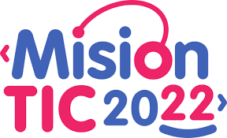

# Introducción 

Aqui se presentan todos los proyectos, retos desarrollados en el marco del programa de MisiontIC 2022 en la Universidad del Norte. 

# Organización del contenido.

El contenido presentado se organiza en semanas de trabajo, excluyendo retos. Estos ultimos son atemporales e involucran contenido de varias semanas.

TODO: Requires re-work.

1. [Semana 1](MisionTIC2022/tree/main/Semana%201)
2. [Semana 2](MisionTIC2022/tree/main/Semana%202)
3. [Retos](MisionTIC2022/tree/main/Retos) 

Por organizar